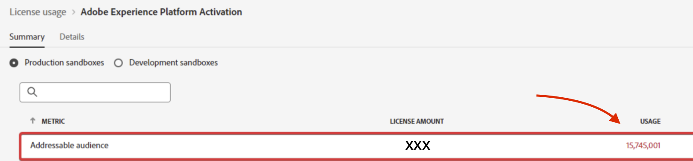

# AEP - 라이선스 사용 섹션의 주소 지정 가능한 대상이 홈 페이지의 프로필 수와 일치하지 않음

라이선스 사용 섹션의 주소 지정 가능한 대상이 홈 페이지의 프로필 수와 일치하지 않습니다.

## 설명 {#description}

Experience Platform 시 다음과 같이 서로 다른 위치에서 서로 다른 숫자를 볼 수 있습니다.           홈 페이지의 총 프로필 수:             라이센스 사용의 대응 가능 대상:     

## 해결 방법 {#resolution}

대응 가능 대상의 계산은 총 프로필 수와 다릅니다.

대응 가능 대상은 스토어에 있는 프로필입니다 <u>관계없이</u> 모든 병합 정책에 대해 홈 페이지의 전체 프로필 상자와 같은 대시보드에 표시되는 것은 기본 병합 정책을 기반으로 하는 프로필입니다.
