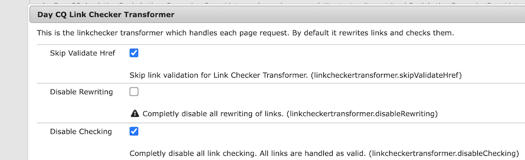

# Adobe Experience Manager: LinkChecker에서 특수 문자에 대한 URL 유효성 검사를 무시하는 방법

## 설명 {#description}

  사용자 지정 구성 요소는 URL에 유효하지 않은 특수 문자가 포함된 링크를 렌더링해야 할 수 있습니다. LinkChecker 구성의 &#39;검사 비활성화&#39; 옵션이 true로 설정되어 있더라도 LinkChecker는 렌더링된 HTML에서 링크를 확인하고 제거합니다.         예:  URL에 유효하지 않은 문자 &quot;{&quot; 및 &quot;}&quot;를 포함하는 링크입니다.   `<` span`>` `<` a href=&quot;{testURL}&quot;`>` 테스트 URL`<` /a`>` `<` /span`>`      LinkChecker는 렌더링된 HTML에서 링크를 제거합니다.  `<` span`>` `>` 테스트 URL`<` /span`>`      그런 다음 이 유효성 검사 프로세스의 결과로 URISyntaxException이 error.log에 기록됩니다.     23.01.2024 12:43:34.500 \*경고\* `[` 000.000.000.000 `[` 1705981414300`]`  GET /content/wknd/language-masters/en/test.html HTTP/1.1`]`  com.day.cq.rewriter.linkchecker.impl.LinkCheckerImpl 잘못된 형식의 URI를 무시합니다. java.net.URISyntaxException: 인덱스 0의 경로에 잘못된 문자가 있습니다. {testURL}  이 문서에서는 URL 유효성 검사를 무시하고 링크를 그대로 유지하는 방법에 대해 설명합니다     <b>환경</b>  AEM as a Cloud Service, AEM 6.5.17    

## 해결 방법 {#resolution}

구성 요소의 HTL에 있는 링크에 &#39;x-cq-linkchecker=&quot;skip&quot;&#39; 속성을 추가합니다. 이 속성은 LinkChecker가 URL 유효성 검사를 완전히 무시하도록 지시합니다.   예: URL에 잘못된 문자 &quot;{&quot; 및 &quot;}&quot;를 사용하는 링크입니다.  `<` span`>` `<` a x-cq-linkchecker=&quot;skip&quot; href=&quot;{testURL}&quot;`>` 테스트 URL`<` /a`>` `<` /span`>`    링크는 렌더링된 HTML에 남아 있습니다. `<` span`>` `<` a x-cq-linkchecker=&quot;skip&quot; href=&quot;{testURL}&quot;`>` 테스트 URL`<` /a`>` `<` /span`>`    